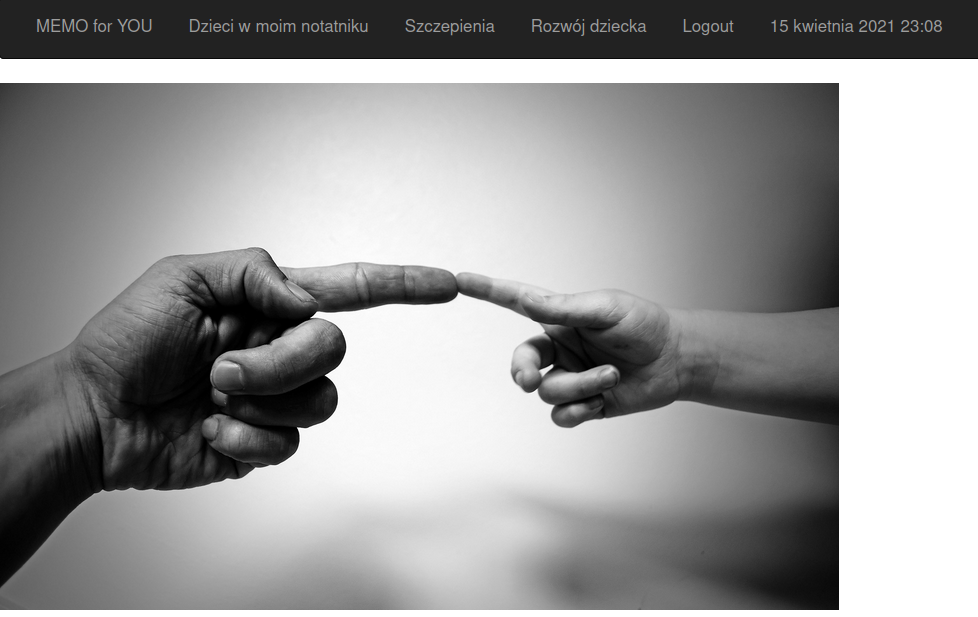
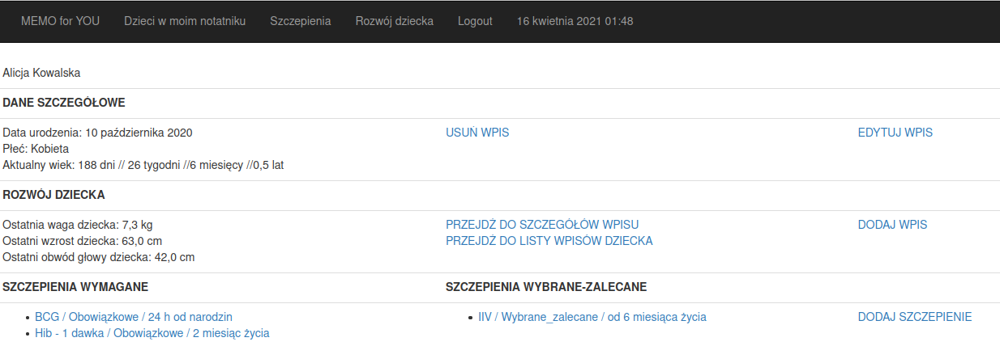
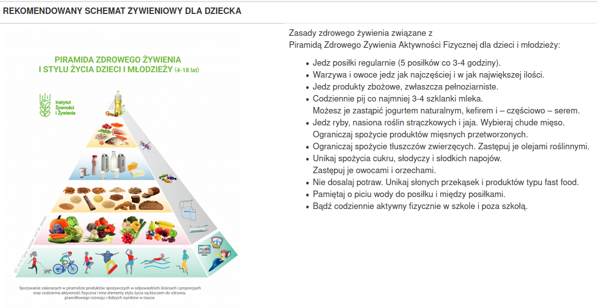

Thank you for your interest in my project. 
Below you can find some information about my app.

# MEMO for YOU

This app named "MEMO for YOU" is designed to help the parents to manage information 
about the child on every step of his life. The assumption of the project is to save all important 
and less important data here, so that in the future you can easily and quickly find any information 
about the child's development. However, you decide what information you want to save 
in the application and which will be available for you later. Of course all sensitive data 
is available only to logged in users.  

### Children in my notes

Here you can add new child to the app and see the list of all children that already existing in the app.

#### Child detail

On these view you will find all information about the chosen child, like:
- main information (first name, second name, age, gender, etc.)
- child development (you will always see here the latest data about child development and 
  url that redirect you to -> Measurement Details and -> List of Child Development Measurements)
  
  ##### Measurement Detail
  
  Here you will find age of the child (on the day of measurement) and measurements detail: 
  weight, height and circumference of the child's head that is actual for the chosen child development. 
  In a right side you can compare the measurements on three percentile grids. Special for your convenience, 
  the charts are selected on the moving carousel, jumping from one chart to the next. 
  Thanks to that, they are good visible. For measurements of children above 5 years, instead of charts 
  there would be an url available, that redirect you to the external side with BMI calculator.
  
  ##### List of Child Development Measurements
  
  
- child vaccinations (there are two lists with names of vaccinations that the child had. 
  Those vaccinations are also urls that will redirect you to details of chosen vaccination and 
  next to chosen vaccine)
  ##### Vaccine Detail
  
  Here is also url that redirect you to the external side, where you can find more information 
  about vaccines.
  
  ####
- recommended nutrition scheme for a child ( varies depending on the current age of the child )
  #### View for the child in age of 6 months.
   
  #### View for the child in age above 11 months.
  

## The end
Thank you for your interest.
If you will have some idea what it could be changed in this project, 
you are very welcome to create pull requests. 
I'm always open for all suggestions.
